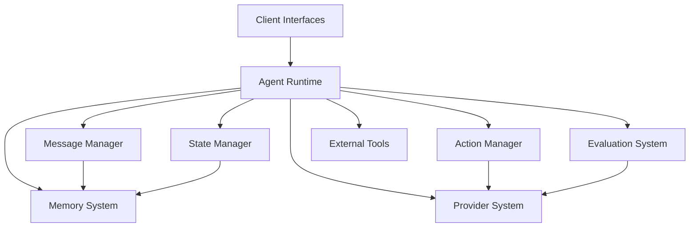
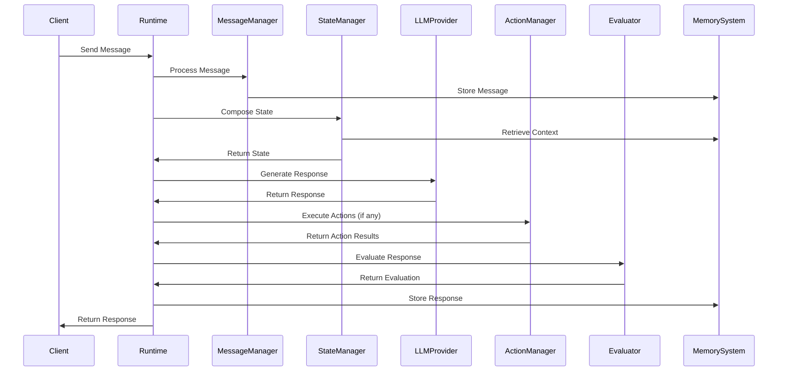

# System Patterns: Carrier

## Architecture Overview
Carrier follows a modular, event-driven architecture based on a central runtime loop. The system is designed around these core components:



The architecture implements a processing pipeline that takes user inputs from various clients, processes them through a series of steps, and produces agent responses with potential actions.

## Key Technical Decisions

1. **Python as Implementation Language**
   - Replaces Node.js used in ElizaOS
   - Leverages Python's strengths in async processing, data validation, and ML ecosystem

2. **Asynchronous Processing**
   - Use of `asyncio` for non-blocking operations
   - Event-driven architecture for efficient handling of concurrent requests

3. **Data Validation with Pydantic**
   - Strong typing and validation for all system data structures
   - Runtime validation to prevent errors and ensure data consistency

4. **Message-Based Communication**
   - Standardized memory objects for all system communications
   - Event-driven approach for decoupling components

5. **Pluggable Architecture**
   - Support for dynamic loading of plugins, tools, and providers
   - Extension points for customization without core code changes

## Design Patterns

### 1. Factory Pattern
Used for creating different types of agents, providers, and tools:

```python
class AgentFactory:
    @staticmethod
    def create_agent(agent_type: str, config: Dict) -> Agent:
        if agent_type == "conversational":
            return ConversationalAgent(config)
        elif agent_type == "task":
            return TaskAgent(config)
        # ...
```

### 2. Strategy Pattern
Used for implementing different LLM providers and message processing strategies:

```python
class LLMProvider(ABC):
    @abstractmethod
    async def generate_text(self, prompt: str, **params) -> str:
        pass

class OpenAIProvider(LLMProvider):
    async def generate_text(self, prompt: str, **params) -> str:
        # OpenAI implementation
        
class AnthropicProvider(LLMProvider):
    async def generate_text(self, prompt: str, **params) -> str:
        # Anthropic implementation
```

### 3. Observer Pattern
Used for the event system that notifies components of state changes:

```python
class EventEmitter:
    def __init__(self):
        self._listeners = defaultdict(list)
        
    def on(self, event: str, callback: Callable):
        self._listeners[event].append(callback)
        
    def emit(self, event: str, *args, **kwargs):
        for callback in self._listeners[event]:
            asyncio.create_task(callback(*args, **kwargs))
```

### 4. Chain of Responsibility
Used in the message processing pipeline:

```python
class MessageProcessor:
    def __init__(self):
        self.processors = []
        
    def add_processor(self, processor: Callable):
        self.processors.append(processor)
        
    async def process(self, message: Message) -> Message:
        result = message
        for processor in self.processors:
            result = await processor(result)
        return result
```

### 5. Dependency Injection
Used throughout the system to provide components with their dependencies:

```python
class AgentRuntime:
    def __init__(
        self,
        message_manager: MessageManager,
        state_manager: StateManager,
        action_manager: ActionManager,
        evaluator: Evaluator,
        llm_provider: LLMProvider
    ):
        self.message_manager = message_manager
        self.state_manager = state_manager
        self.action_manager = action_manager
        self.evaluator = evaluator
        self.llm_provider = llm_provider
```

## Component Relationships

### Agent Runtime
The central coordinator that manages the entire system:
- Initializes all components
- Processes incoming messages
- Manages the state
- Coordinates action execution
- Handles evaluation and memory storage

### Message Manager
Handles all aspects of message processing:
- Receives messages from clients
- Standardizes message format
- Adds embeddings for semantic search
- Stores messages in the database

### State Manager
Manages the agent's state:
- Composes state from various sources
- Retrieves relevant history and context
- Manages conversation flow

### Action Manager
Handles the execution of actions:
- Validates action requests
- Executes actions using appropriate tools
- Returns results to the runtime

### Evaluation System
Assesses the quality of responses:
- Applies evaluators to agent responses
- Triggers improvements when necessary
- Provides feedback for learning

### Memory System
Manages persistent storage of interactions:
- Stores conversation history
- Retrieves relevant memories
- Provides context for state composition

### Provider System
Integrates with external LLM services:
- Implements provider-specific API calls
- Handles rate limiting and fallbacks
- Processes prompt templates

## Data Flow



The flow begins with a message received from a client interface. This message is processed through the pipeline, with each component performing its specific role. The final response is then sent back to the client, with the entire interaction stored in memory.

## API Design

### Client API
Provides endpoints for client applications to interact with agents:

```python
@app.post("/{agent_id}/message")
async def receive_message(
    agent_id: str,
    request: Request,
    file: Optional[UploadFile] = None
):
    # Process message and return response
```

### Agent Configuration API
Allows for agent creation and configuration:

```python
@app.post("/agents")
async def create_agent(agent_config: AgentConfig):
    # Create and configure a new agent
    
@app.put("/agents/{agent_id}")
async def update_agent(agent_id: str, agent_config: AgentConfig):
    # Update an existing agent's configuration
```

### Tool Registration API
Enables registration of new tools for agents to use:

```python
@app.post("/tools")
async def register_tool(tool_config: ToolConfig):
    # Register a new tool for use by agents
```

## Security Considerations

1. **Authentication and Authorization**
   - Token-based authentication for API access
   - Role-based access control for agent management
   - Fine-grained permissions for tool usage

2. **Data Protection**
   - Encryption of sensitive data in transit and at rest
   - Configurable data retention policies
   - Access controls for memory retrieval

3. **Input Validation**
   - Strict validation of all inputs using Pydantic
   - Prevention of prompt injection attacks
   - Sanitization of user inputs

4. **Action Restrictions**
   - Configurable limitations on tool usage
   - Approval workflows for sensitive actions
   - Validation of action parameters

## Scalability Approach

1. **Horizontal Scaling**
   - Stateless design for agent runtimes
   - Support for multiple instances of the same agent
   - Load balancing across instances

2. **Database Scaling**
   - Partitioning of memory storage by agent and time
   - Read replicas for memory retrieval
   - Caching of frequently accessed memories

3. **Processing Optimization**
   - Batched embedding generation
   - Parallel processing of independent operations
   - Efficient vector search for memory retrieval

4. **Resource Management**
   - Configurable limits on conversation length
   - Automatic cleanup of old conversations
   - Rate limiting for external API calls

## Notes
The Carrier system architecture adapts the core concepts from ElizaOS while leveraging Python's ecosystem. The focus is on creating a modular, extensible framework that can support a wide range of agent types and use cases while maintaining a consistent approach to message processing, state management, and tool usage.
