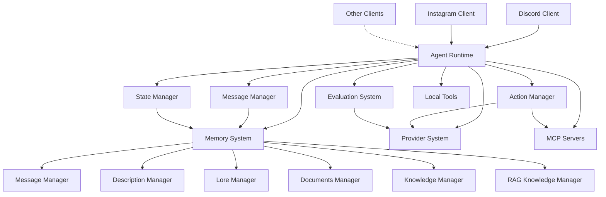
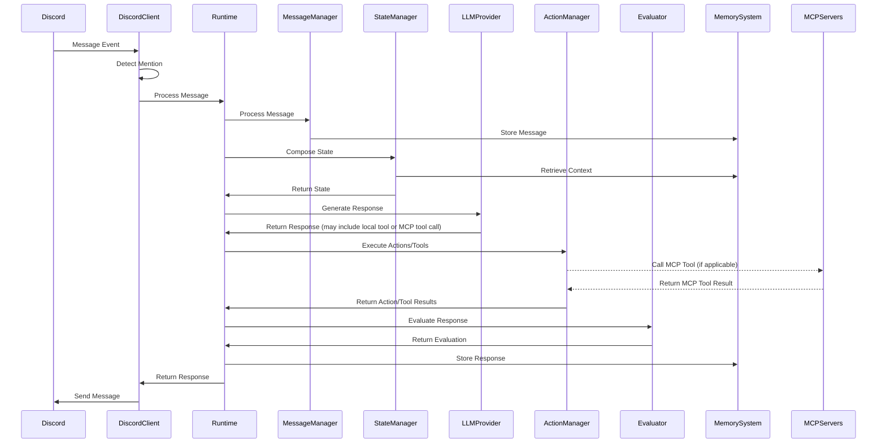
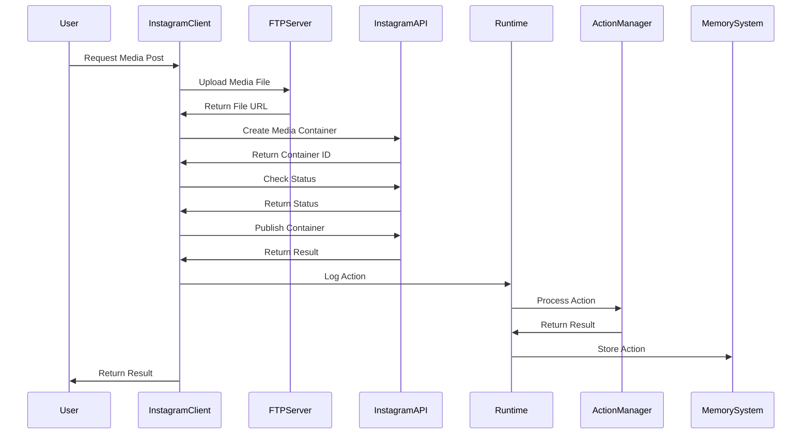
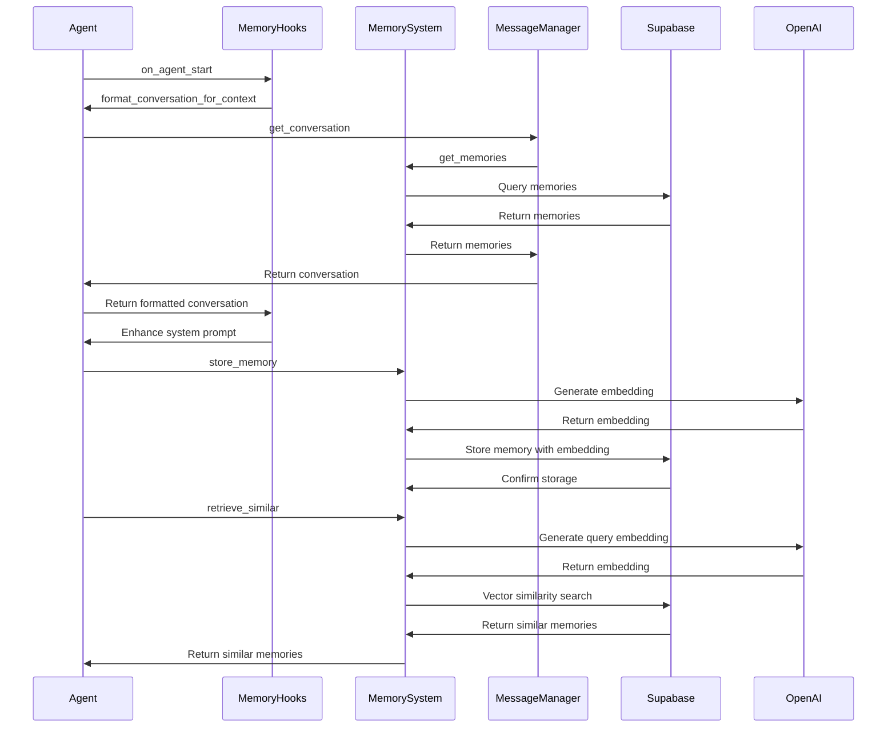

# System Patterns: Carrier

## Architecture Overview
Carrier follows a modular, event-driven architecture based on a central runtime loop. The system is designed around these core components:



The architecture implements a processing pipeline that takes user inputs from various clients, processes them through a series of steps, and produces agent responses with potential actions. The multi-client design allows agents to interact through different channels while maintaining a consistent processing approach.

## Key Technical Decisions

1. **Python as Implementation Language**
   - Replaces Node.js used in ElizaOS
   - Leverages Python's strengths in async processing, data validation, and ML ecosystem

2. **Asynchronous Processing**
   - Use of `asyncio` for non-blocking operations
   - Event-driven architecture for efficient handling of concurrent requests

3. **Data Validation with Pydantic**
   - Strong typing and validation for all system data structures
   - Runtime validation to prevent errors and ensure data consistency

4. **Message-Based Communication**
   - Standardized memory objects for all system communications
   - Event-driven approach for decoupling components

5. **Pluggable Architecture**
   - Support for dynamic loading of plugins, tools, and providers
   - Extension points for customization without core code changes

6. **Vector-Based Memory System**
   - Supabase with PostgreSQL and vector extensions for memory storage
   - OpenAI embeddings for semantic representation of text
   - Vector similarity search for retrieving relevant memories
   - Integration with OpenAI Agent SDK for core agent functionality and MCP support

## Design Patterns

### 1. Factory Pattern
Used for creating different types of agents, providers, and tools:

```python
class AgentFactory:
    @staticmethod
    def create_agent(agent_type: str, config: Dict) -> Agent:
        if agent_type == "conversational":
            return ConversationalAgent(config)
        elif agent_type == "task":
            return TaskAgent(config)
        # ...
```

### 2. Strategy Pattern
Used for implementing different LLM providers and message processing strategies:

```python
class LLMProvider(ABC):
    @abstractmethod
    async def generate_text(self, prompt: str, **params) -> str:
        pass

class OpenAIProvider(LLMProvider):
    async def generate_text(self, prompt: str, **params) -> str:
        # OpenAI implementation
        
class AnthropicProvider(LLMProvider):
    async def generate_text(self, prompt: str, **params) -> str:
        # Anthropic implementation
```

### 3. Observer Pattern
Used for the event system that notifies components of state changes:

```python
class EventEmitter:
    def __init__(self):
        self._listeners = defaultdict(list)
        
    def on(self, event: str, callback: Callable):
        self._listeners[event].append(callback)
        
    def emit(self, event: str, *args, **kwargs):
        for callback in self._listeners[event]:
            asyncio.create_task(callback(*args, **kwargs))
```

### 4. Chain of Responsibility
Used in the message processing pipeline:

```python
class MessageProcessor:
    def __init__(self):
        self.processors = []
        
    def add_processor(self, processor: Callable):
        self.processors.append(processor)
        
    async def process(self, message: Message) -> Message:
        result = message
        for processor in self.processors:
            result = await processor(result)
        return result
```

### 5. Dependency Injection
Used throughout the system to provide components with their dependencies:

```python
class AgentRuntime:
    def __init__(
        self,
        message_manager: MessageManager,
        state_manager: StateManager,
        action_manager: ActionManager,
        evaluator: Evaluator,
        llm_provider: LLMProvider
    ):
        self.message_manager = message_manager
        self.state_manager = state_manager
        self.action_manager = action_manager
        self.evaluator = evaluator
        self.llm_provider = llm_provider
```

### 6. Repository Pattern
Used in the memory system for data access abstraction:

```python
class MemorySystem:
    def __init__(self, supabase_url: str, supabase_key: str):
        self.supabase = create_client(supabase_url, supabase_key)
        
    async def store_memory(self, content, memory_type, user_id, room_id, agent_id, metadata=None):
        # Store memory in the database
        
    async def retrieve_similar(self, query, threshold=0.7, limit=10, memory_type=None):
        # Retrieve similar memories using vector search
```

### 7. Manager Pattern
Used for specialized memory managers:

```python
class BaseMemoryManager:
    def __init__(self, memory_system: MemorySystem):
        self.memory_system = memory_system

class MessageManager(BaseMemoryManager):
    async def create_memory(self, message: Dict[str, Any]) -> str:
        # Create a new message memory
        
    async def get_conversation(self, user_id: str, room_id: str, agent_id: str, limit: int = 20):
        # Get recent conversation messages
```

### 8. MCP Integration Pattern
Leverages the OpenAI Agent SDK to connect to and interact with MCP servers, managed centrally:
- **Configuration**: A central `config/mcp_servers.json` file defines all available MCP servers (stdio or sse) with their connection parameters (`command`, `args`, `env`, `url`, `headers`, etc.) and unique names (keys). API keys referenced in `env` are loaded from the environment (`.env`).
- **Character Files**: Agent character files (`characters/*.json`) list the *names* of the MCP servers they require access to (e.g., `["filesystem", "brave-search"]`).
- **Centralized Management (`run_agents.py`)**:
    - On startup, identifies the unique set of MCP servers needed by all agents being run.
    - Uses `contextlib.AsyncExitStack` to start these unique servers concurrently using `MCPServerStdio` or `MCPServerSse`, looking up configurations from the central JSON file.
    - Manages the lifecycle of these server processes/connections.
    - Stores active server instances in a map accessible during agent initialization.
- **Agent Initialization (`initialize_agent` in `run_agents.py`)**:
    - Receives the list of *active* MCP server instances relevant to the specific agent.
    - Calls `await server.list_tools()` on each active server to fetch available MCP tool schemas and descriptions.
    - Combines MCP tool descriptions with built-in tool descriptions.
    - Passes the combined descriptions to `build_system_prompt`.
    - Passes the list of active MCP server instances and the list of *built-in* tool objects to the `Agent` constructor (`mcp_servers=[...]`, `tools=[...]`). The SDK internally uses the `mcp_servers` list to handle MCP tool availability and execution.
- **Tool Execution**: When the LLM calls an MCP tool, the SDK routes the `call_tool()` request to the appropriate active `MCPServer` instance managed by `run_agents.py`.
- **Introspection**: A built-in `list_available_tools` tool allows agents to report on their combined built-in and MCP tools.

```python
# Simplified conceptual flow in run_agents.py

import contextlib
from agents.mcp import MCPServerStdio, MCPServerSse

mcp_configs = load_mcp_server_configs("config/mcp_servers.json")
required_server_names = get_unique_required_servers(character_files)
active_servers_map = {}

async with contextlib.AsyncExitStack() as stack:
    # Start required servers from config
    for name in required_server_names:
        config = mcp_configs[name]
        # ... load env vars, create MCPServerStdio/Sse instance ...
        server_instance = MCPServerStdio(...) # or MCPServerSse
        active_server = await stack.enter_async_context(server_instance)
        active_servers_map[name] = active_server
        logger.info(f"MCP Server {name} started.")

    # Initialize agents, passing relevant active servers
    for char_file in character_files:
        agent_mcp_names = get_agent_mcp_names(char_file)
        agent_active_servers = [active_servers_map[name] for name in agent_mcp_names if name in active_servers_map]
        agent, memory = await initialize_agent(char_file, active_mcp_servers=agent_active_servers)
        # ... start client task ...

    # ... await asyncio.gather(client_tasks) ...

# Servers are automatically stopped when exiting the 'async with' block
```

## Component Relationships

### Agent Runtime
The central coordinator that manages the entire system:
- Initializes all components
- Processes incoming messages
- Manages the state
- Coordinates action execution
- Handles evaluation and memory storage
- Manages multiple client interfaces

### Message Manager
Handles all aspects of message processing:
- Receives messages from clients
- Standardizes message format
- Adds embeddings for semantic search
- Stores messages in the database

### State Manager
Manages the agent's state:
- Composes state from various sources
- Retrieves relevant history and context
- Manages conversation flow
- Tracks client-specific context

### Action Manager
Handles the execution of actions, including both locally defined tools and tools provided by connected MCP servers:
- Validates action requests
- Executes local actions directly
- Delegates MCP tool calls to the appropriate MCP server via the OpenAI Agent SDK
- Returns results to the runtime
- Supports client-specific actions

### Evaluation System
Assesses the quality of responses:
- Applies evaluators to agent responses
- Triggers improvements when necessary
- Provides feedback for learning
- Adapts evaluation to client context

### Memory System
Manages persistent storage of interactions:
- Stores conversation history
- Retrieves relevant memories
- Provides context for state composition
- Tracks client source in memory objects
- Generates embeddings for semantic search
- Performs vector similarity search
- Manages different types of memories through specialized managers

#### Memory Managers
Specialized interfaces for different memory types:
- **MessageManager**: Handles conversation messages
- **DescriptionManager**: Manages user descriptions
- **LoreManager**: Stores agent background information
- **DocumentsManager**: Handles large documents
- **KnowledgeManager**: Manages searchable knowledge fragments
- **RAGKnowledgeManager**: Implements retrieval-augmented generation

### Provider System
Integrates with external LLM services:
- Implements provider-specific API calls
- Handles rate limiting and fallbacks
- Processes prompt templates

### Discord Client
Handles Discord-specific interactions:
- Connects to Discord using discord.py
- Processes message events
- Detects mentions and tags
- Sends responses to Discord channels
- Implements Discord-specific hooks

### Instagram Client
Handles Instagram-specific interactions:
- Connects to Instagram using Graph API
- Uploads media files via FTP
- Posts content to Instagram
- Manages publishing limits
- Implements Instagram-specific hooks

## Data Flow

### Discord Client Flow



### Instagram Client Flow



## Memory System Flow



## API Design

### Client API
Provides endpoints for client applications to interact with agents:

```python
@app.post("/{agent_id}/message")
async def receive_message(
    agent_id: str,
    request: Request,
    file: Optional[UploadFile] = None
):
    # Process message and return response
```

### Media API
Provides endpoints for media operations:

```python
@app.post("/{agent_id}/media")
async def post_media(
    agent_id: str,
    media_file: UploadFile,
    caption: Optional[str] = None
):
    # Upload and post media to Instagram
```

### Agent Configuration API
Allows for agent creation and configuration:

```python
@app.post("/agents")
async def create_agent(agent_config: AgentConfig):
    # Create and configure a new agent
    
@app.put("/agents/{agent_id}")
async def update_agent(agent_id: str, agent_config: AgentConfig):
    # Update an existing agent's configuration
```

### Tool Registration API
Enables registration of new tools for agents to use:

```python
@app.post("/tools")
async def register_tool(tool_config: ToolConfig):
    # Register a new tool for use by agents
```

### Client Configuration API
Allows for client-specific configuration:

```python
@app.post("/clients/{client_id}/config")
async def configure_client(client_id: str, config: ClientConfig):
    # Configure a specific client interface
```

### Memory API
Provides endpoints for memory management:

```python
@app.post("/memories")
async def create_memory(memory: MemoryCreate):
    # Create a new memory
    
@app.get("/memories")
async def get_memories(
    memory_type: Optional[str] = None,
    user_id: Optional[str] = None,
    room_id: Optional[str] = None,
    agent_id: Optional[str] = None,
    limit: int = 20
):
    # Get memories based on filters
    
@app.post("/memories/similar")
async def find_similar_memories(query: SimilarityQuery):
    # Find memories similar to the query
    
@app.delete("/memories")
async def delete_memories(filters: MemoryDeleteFilters):
    # Delete memories based on filters
```

## Security Considerations

1. **Authentication and Authorization**
   - Token-based authentication for API access
   - Role-based access control for agent management
   - Fine-grained permissions for tool usage
   - Client-specific access tokens (Discord token, Instagram token)

2. **Data Protection**
   - Encryption of sensitive data in transit and at rest
   - Configurable data retention policies
   - Access controls for memory retrieval
   - Secure handling of media files

3. **Input Validation**
   - Strict validation of all inputs using Pydantic
   - Prevention of prompt injection attacks
   - Sanitization of user inputs
   - Media file validation and scanning

4. **Action Restrictions**
   - Configurable limitations on tool usage
   - Approval workflows for sensitive actions
   - Validation of action parameters
   - Rate limiting for API calls to external services
   - Publishing limits for Instagram posts

5. **Memory Privacy**
   - Access controls for memory retrieval
   - User-specific memory isolation
   - Configurable memory retention policies
   - Consent management for memory storage

## Scalability Approach

1. **Horizontal Scaling**
   - Stateless design for agent runtimes
   - Support for multiple instances of the same agent
   - Load balancing across instances

2. **Database Scaling**
   - Partitioning of memory storage by agent and time
   - Read replicas for memory retrieval
   - Caching of frequently accessed memories
   - Vector index optimization for similarity search

3. **Processing Optimization**
   - Batched embedding generation
   - Parallel processing of independent operations
   - Efficient vector search for memory retrieval
   - Caching of embeddings for frequently accessed content

4. **Resource Management**
   - Configurable limits on conversation length
   - Automatic cleanup of old conversations
   - Rate limiting for external API calls
   - Memory pruning and summarization for long-running conversations

## Memory System Architecture

### Database Schema
The memory system uses a PostgreSQL database with the pgvector extension for vector operations. The main tables are:

1. **memories**: Stores all memory objects with vector embeddings
   - id: UUID (primary key)
   - type: TEXT (message, description, lore, document, knowledge)
   - content: JSONB (memory content)
   - embedding: vector(1536) (OpenAI embedding)
   - user_id: TEXT (user identifier)
   - room_id: TEXT (conversation/room identifier)
   - agent_id: TEXT (agent identifier)
   - metadata: JSONB (additional metadata)
   - created_at: TIMESTAMP (creation timestamp)

2. **relationships**: Stores relationship information between users and agents
   - id: UUID (primary key)
   - user_id: TEXT (user identifier)
   - agent_id: TEXT (agent identifier)
   - interaction_count: INTEGER (number of interactions)
   - sentiment_score: FLOAT (relationship sentiment)
   - metadata: JSONB (additional metadata)
   - last_interaction: TIMESTAMP (last interaction timestamp)
   - created_at: TIMESTAMP (creation timestamp)

### Vector Search
The memory system uses vector similarity search for retrieving relevant memories:

```sql
SELECT
    m.id,
    m.type,
    m.content,
    m.embedding,
    m.user_id,
    m.room_id,
    m.agent_id,
    m.metadata,
    m.created_at,
    1 - (m.embedding <=> $1) as similarity
FROM
    memories m
WHERE
    m.embedding IS NOT NULL AND
    1 - (m.embedding <=> $1) > $2
ORDER BY
    m.embedding <=> $1
LIMIT $3
```

### Memory Managers
The memory system provides specialized managers for different memory types:

1. **MessageManager**: Handles conversation messages
2. **DescriptionManager**: Manages user descriptions
3. **LoreManager**: Stores agent background information
4. **DocumentsManager**: Handles large documents
5. **KnowledgeManager**: Manages searchable knowledge fragments
6. **RAGKnowledgeManager**: Implements retrieval-augmented generation

### Memory CLI
The memory system includes a CLI tool for management operations:

```bash
# List memories
python -m src.tools.memory_cli list --agent assistant --format

# Clear memories
python -m src.tools.memory_cli clear assistant

# Test similar memory retrieval
python -m src.tools.memory_cli similar "query text" --agent assistant

# Initialize database schema
python -m src.tools.memory_cli init
```

## Notes
The Carrier project is designed as a Python reimplementation of the ElizaOS runtime loop, with adaptations to leverage Python's strengths in asyncio, data validation (Pydantic), and web services (FastAPI). The architecture maintains the core concepts of ElizaOS while providing a more Pythonic experience for developers.

Key differences from ElizaOS include the use of Python's async/await pattern, Pydantic models for data validation, and FastAPI for HTTP endpoints. The memory system utilizes PostgreSQL with vector extensions for efficient semantic search, which is critical for the context-aware agent functionality.

The multi-client architecture allows for integration with different platforms, with Discord providing conversational interactions and Instagram enabling media posting capabilities. Each client implementation follows a similar pattern with client-specific adaptations for the unique requirements of each platform. The Discord client uses discord.py for event-based message handling, while the Instagram client uses the Instagram Graph API with a two-step posting process (container creation followed by publishing).

The memory system extends the framework's capabilities by providing persistent storage and retrieval of interactions, enabling context-aware responses across multiple conversations and platforms. The vector-based approach allows for semantic search, retrieving memories based on content similarity rather than just exact matches or timestamps.

The FTP integration for Instagram media posting demonstrates how the framework can handle different types of content beyond text, providing a foundation for future expansions to additional media types and platforms.
