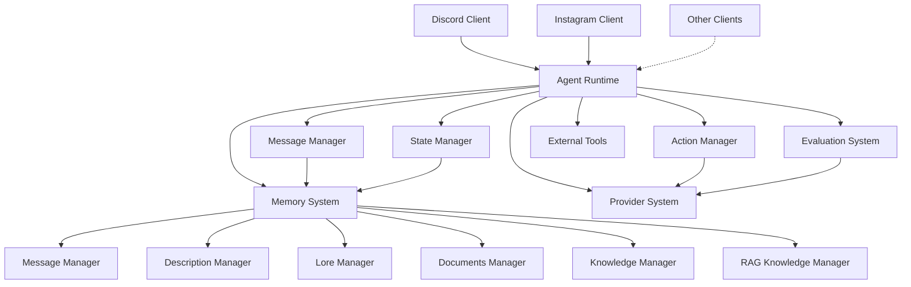
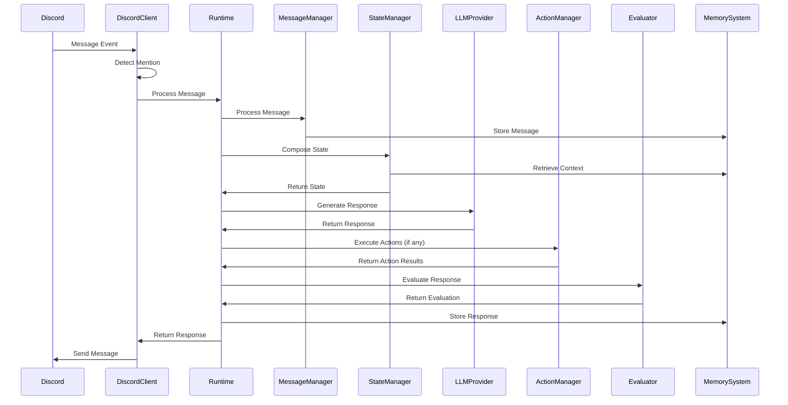
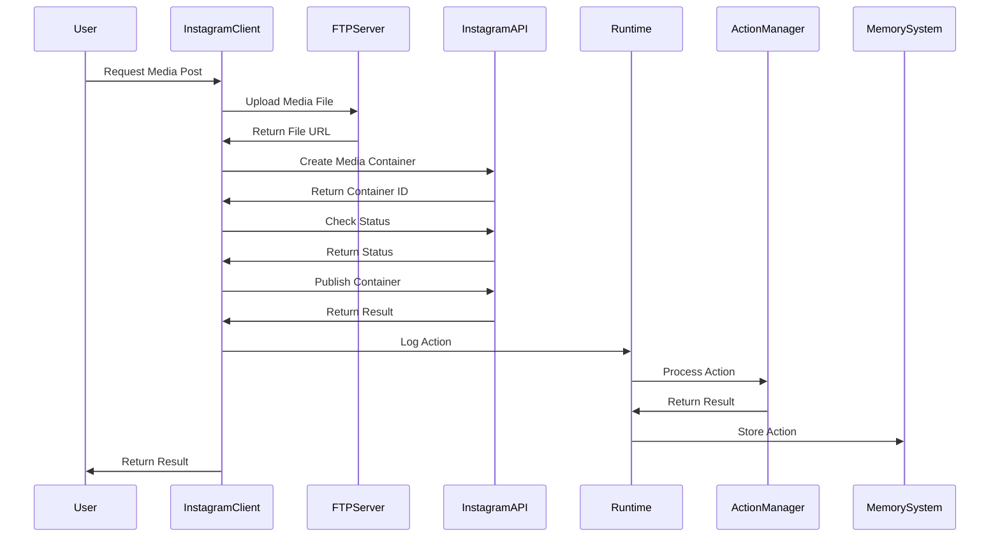
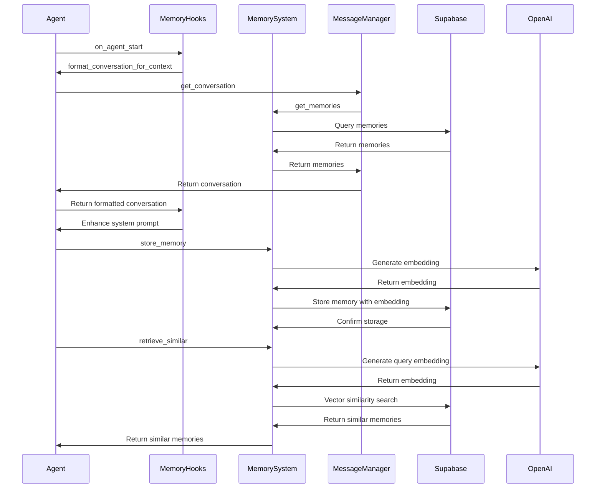
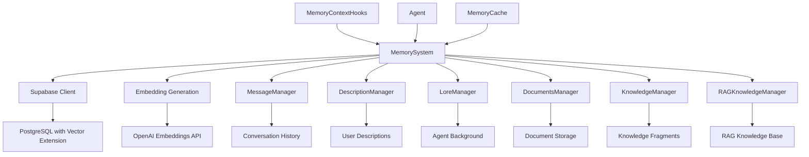

# System Patterns: Carrier

## Architecture Overview
Carrier follows a modular, event-driven architecture based on a central runtime loop. The system is designed around these core components:



The architecture implements a processing pipeline that takes user inputs from various clients, processes them through a series of steps, and produces agent responses with potential actions. The multi-client design allows agents to interact through different channels while maintaining a consistent processing approach.

## Key Technical Decisions

1. **Python as Implementation Language**
   - Replaces Node.js used in ElizaOS
   - Leverages Python's strengths in async processing, data validation, and ML ecosystem

2. **Asynchronous Processing**
   - Use of `asyncio` for non-blocking operations
   - Event-driven architecture for efficient handling of concurrent requests

3. **Data Validation with Pydantic**
   - Strong typing and validation for all system data structures
   - Runtime validation to prevent errors and ensure data consistency

4. **Message-Based Communication**
   - Standardized memory objects for all system communications
   - Event-driven approach for decoupling components

5. **Pluggable Architecture**
   - Support for dynamic loading of plugins, tools, and providers
   - Extension points for customization without core code changes

6. **Vector-Based Memory System**
   - Supabase with PostgreSQL and vector extensions for memory storage
   - OpenAI embeddings for semantic representation of text
   - Vector similarity search for retrieving relevant memories

## Design Patterns

### 1. Factory Pattern
Used for creating different types of agents, providers, and tools:

```python
class AgentFactory:
    @staticmethod
    def create_agent(agent_type: str, config: Dict) -> Agent:
        if agent_type == "conversational":
            return ConversationalAgent(config)
        elif agent_type == "task":
            return TaskAgent(config)
        # ...
```

### 2. Strategy Pattern
Used for implementing different LLM providers and message processing strategies:

```python
class LLMProvider(ABC):
    @abstractmethod
    async def generate_text(self, prompt: str, **params) -> str:
        pass

class OpenAIProvider(LLMProvider):
    async def generate_text(self, prompt: str, **params) -> str:
        # OpenAI implementation
        
class AnthropicProvider(LLMProvider):
    async def generate_text(self, prompt: str, **params) -> str:
        # Anthropic implementation
```

### 3. Observer Pattern
Used for the event system that notifies components of state changes:

```python
class EventEmitter:
    def __init__(self):
        self._listeners = defaultdict(list)
        
    def on(self, event: str, callback: Callable):
        self._listeners[event].append(callback)
        
    def emit(self, event: str, *args, **kwargs):
        for callback in self._listeners[event]:
            asyncio.create_task(callback(*args, **kwargs))
```

### 4. Chain of Responsibility
Used in the message processing pipeline:

```python
class MessageProcessor:
    def __init__(self):
        self.processors = []
        
    def add_processor(self, processor: Callable):
        self.processors.append(processor)
        
    async def process(self, message: Message) -> Message:
        result = message
        for processor in self.processors:
            result = await processor(result)
        return result
```

### 5. Dependency Injection
Used throughout the system to provide components with their dependencies:

```python
class AgentRuntime:
    def __init__(
        self,
        message_manager: MessageManager,
        state_manager: StateManager,
        action_manager: ActionManager,
        evaluator: Evaluator,
        llm_provider: LLMProvider
    ):
        self.message_manager = message_manager
        self.state_manager = state_manager
        self.action_manager = action_manager
        self.evaluator = evaluator
        self.llm_provider = llm_provider
```

### 6. Repository Pattern
Used in the memory system for data access abstraction:

```python
class MemorySystem:
    def __init__(self, supabase_url: str, supabase_key: str):
        self.supabase = create_client(supabase_url, supabase_key)
        
    async def store_memory(self, content, memory_type, user_id, room_id, agent_id, metadata=None):
        # Store memory in the database
        
    async def retrieve_similar(self, query, threshold=0.7, limit=10, memory_type=None):
        # Retrieve similar memories using vector search
```

### 7. Manager Pattern
Used for specialized memory managers:

```python
class BaseMemoryManager:
    def __init__(self, memory_system: MemorySystem):
        self.memory_system = memory_system

class MessageManager(BaseMemoryManager):
    async def create_memory(self, message: Dict[str, Any]) -> str:
        # Create a new message memory
        
    async def get_conversation(self, user_id: str, room_id: str, agent_id: str, limit: int = 20):
        # Get recent conversation messages
```

### 8. Hook Pattern
Used for integrating memory with agent runtime:

```python
class MemoryContextHooks(RunHooks):
    def __init__(self, user_id: str, room_id: str, conversation_limit: int = 10):
        self.user_id = user_id
        self.room_id = room_id
        self.conversation_limit = conversation_limit
        
    async def on_agent_start(self, context: RunContextWrapper, agent: Agent) -> None:
        # Add conversation history to system prompt
```

## Component Relationships

### Agent Runtime
The central coordinator that manages the entire system:
- Initializes all components
- Processes incoming messages
- Manages the state
- Coordinates action execution
- Handles evaluation and memory storage
- Manages multiple client interfaces

### Message Manager
Handles all aspects of message processing:
- Receives messages from clients
- Standardizes message format
- Adds embeddings for semantic search
- Stores messages in the database

### State Manager
Manages the agent's state:
- Composes state from various sources
- Retrieves relevant history and context
- Manages conversation flow
- Tracks client-specific context

### Action Manager
Handles the execution of actions:
- Validates action requests
- Executes actions using appropriate tools
- Returns results to the runtime
- Supports client-specific actions

### Evaluation System
Assesses the quality of responses:
- Applies evaluators to agent responses
- Triggers improvements when necessary
- Provides feedback for learning
- Adapts evaluation to client context

### Memory System
Manages persistent storage of interactions:
- Stores conversation history
- Retrieves relevant memories
- Provides context for state composition
- Tracks client source in memory objects
- Generates embeddings for semantic search
- Performs vector similarity search
- Manages different types of memories through specialized managers

#### Memory Managers
Specialized interfaces for different memory types:
- **MessageManager**: Handles conversation messages
- **DescriptionManager**: Manages user descriptions
- **LoreManager**: Stores agent background information
- **DocumentsManager**: Handles large documents
- **KnowledgeManager**: Manages searchable knowledge fragments
- **RAGKnowledgeManager**: Implements retrieval-augmented generation

### Provider System
Integrates with external LLM services:
- Implements provider-specific API calls
- Handles rate limiting and fallbacks
- Processes prompt templates

### Discord Client
Handles Discord-specific interactions:
- Connects to Discord using discord.py
- Processes message events
- Detects mentions and tags
- Sends responses to Discord channels
- Implements Discord-specific hooks

### Instagram Client
Handles Instagram-specific interactions:
- Connects to Instagram using Graph API
- Uploads media files via FTP
- Posts content to Instagram
- Manages publishing limits
- Implements Instagram-specific hooks

## Data Flow

### Discord Client Flow



### Instagram Client Flow



### Memory System Flow



## API Design

### Client API
Provides endpoints for client applications to interact with agents:

```python
@app.post("/{agent_id}/message")
async def receive_message(
    agent_id: str,
    request: Request,
    file: Optional[UploadFile] = None
):
    # Process message and return response
```

### Media API
Provides endpoints for media operations:

```python
@app.post("/{agent_id}/media")
async def post_media(
    agent_id: str,
    media_file: UploadFile,
    caption: Optional[str] = None
):
    # Upload and post media to Instagram
```

### Agent Configuration API
Allows for agent creation and configuration:

```python
@app.post("/agents")
async def create_agent(agent_config: AgentConfig):
    # Create and configure a new agent
    
@app.put("/agents/{agent_id}")
async def update_agent(agent_id: str, agent_config: AgentConfig):
    # Update an existing agent's configuration
```

### Tool Registration API
Enables registration of new tools for agents to use:

```python
@app.post("/tools")
async def register_tool(tool_config: ToolConfig):
    # Register a new tool for use by agents
```

### Client Configuration API
Allows for client-specific configuration:

```python
@app.post("/clients/{client_id}/config")
async def configure_client(client_id: str, config: ClientConfig):
    # Configure a specific client interface
```

### Memory API
Provides endpoints for memory management:

```python
@app.post("/memories")
async def create_memory(memory: MemoryCreate):
    # Create a new memory
    
@app.get("/memories")
async def get_memories(
    memory_type: Optional[str] = None,
    user_id: Optional[str] = None,
    room_id: Optional[str] = None,
    agent_id: Optional[str] = None,
    limit: int = 20
):
    # Get memories based on filters
    
@app.post("/memories/similar")
async def find_similar_memories(query: SimilarityQuery):
    # Find memories similar to the query
    
@app.delete("/memories")
async def delete_memories(filters: MemoryDeleteFilters):
    # Delete memories based on filters
```

## Security Considerations

1. **Authentication and Authorization**
   - Token-based authentication for API access
   - Role-based access control for agent management
   - Fine-grained permissions for tool usage
   - Client-specific access tokens (Discord token, Instagram token)

2. **Data Protection**
   - Encryption of sensitive data in transit and at rest
   - Configurable data retention policies
   - Access controls for memory retrieval
   - Secure handling of media files

3. **Input Validation**
   - Strict validation of all inputs using Pydantic
   - Prevention of prompt injection attacks
   - Sanitization of user inputs
   - Media file validation and scanning

4. **Action Restrictions**
   - Configurable limitations on tool usage
   - Approval workflows for sensitive actions
   - Validation of action parameters
   - Rate limiting for API calls to external services
   - Publishing limits for Instagram posts

5. **Memory Privacy**
   - Access controls for memory retrieval
   - User-specific memory isolation
   - Configurable memory retention policies
   - Consent management for memory storage

## Scalability Approach

1. **Horizontal Scaling**
   - Stateless design for agent runtimes
   - Support for multiple instances of the same agent
   - Load balancing across instances

2. **Database Scaling**
   - Partitioning of memory storage by agent and time
   - Read replicas for memory retrieval
   - Caching of frequently accessed memories
   - Vector index optimization for similarity search

3. **Processing Optimization**
   - Batched embedding generation
   - Parallel processing of independent operations
   - Efficient vector search for memory retrieval
   - Caching of embeddings for frequently accessed content

4. **Resource Management**
   - Configurable limits on conversation length
   - Automatic cleanup of old conversations
   - Rate limiting for external API calls
   - Memory pruning and summarization for long-running conversations

## Memory System Architecture



The memory system architecture is built around the central MemorySystem class, which provides the core functionality for storing and retrieving memories. It uses Supabase as the database backend, with PostgreSQL and vector extensions for efficient semantic search. The system generates embeddings using OpenAI's embedding API, which are then used for vector similarity search.

Specialized memory managers provide tailored interfaces for different types of memories, making it easier to work with specific kinds of data. The MemoryContextHooks integrate the memory system with the agent runtime, adding conversation history to the agent context for more contextual responses.

The memory system also includes a caching layer for frequently accessed embeddings, reducing the need for repeated API calls and improving performance. The database schema includes tables for memories and relationships, with vector embeddings for semantic search.

## Notes
The Carrier system architecture adapts the core concepts from ElizaOS while leveraging Python's ecosystem. The focus is on creating a modular, extensible framework that can support a wide range of agent types and use cases while maintaining a consistent approach to message processing, state management, and tool usage.

The multi-client architecture demonstrates the flexibility of the framework, allowing agents to interact through different channels (Discord for conversational interactions, Instagram for media posting) while sharing the same core processing pipeline. Each client implementation follows the same pattern of hooks and event handling, but with client-specific adaptations for the unique requirements of each platform.

The memory system extends the framework's capabilities by providing persistent storage and retrieval of interactions, enabling context-aware responses across multiple conversations and platforms. The vector-based approach allows for semantic search, retrieving memories based on content similarity rather than just exact matches or timestamps.

The Instagram client integration extends the framework beyond text-based interactions to include media handling capabilities, showing how the architecture can adapt to different types of content and interaction models. This multi-modal approach provides a foundation for future expansions to additional platforms and interaction types.
